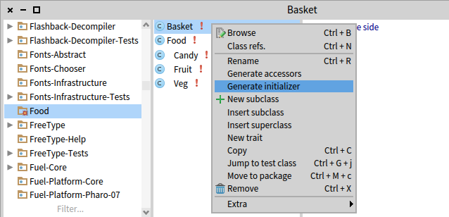
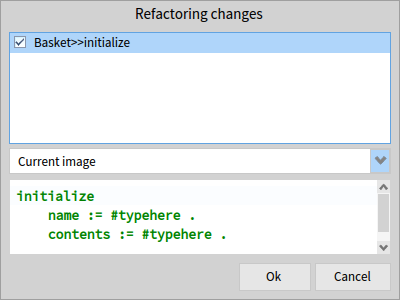

# pharo-refactoring-initialize
Right-click refactor for generating initializers for instance variables in Pharo Smalltalk




## How to install?

Just run this in a Playground: 

```
Gofer new
	 url: 'github://undeadparrot/pharo-refactoring-intialize';
   package: 'Refactoring-Initialize';
   load.
```
